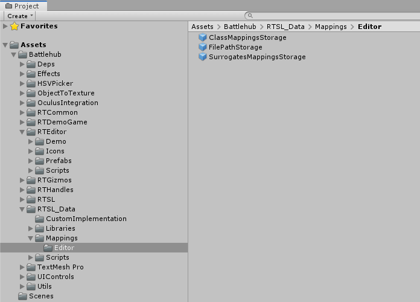
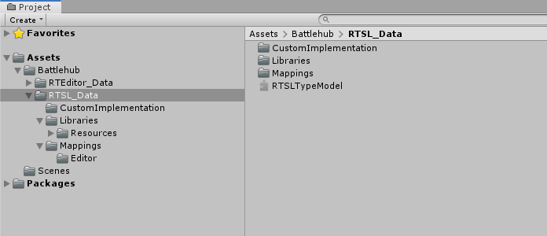
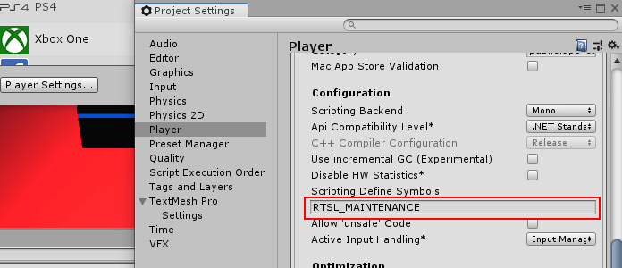
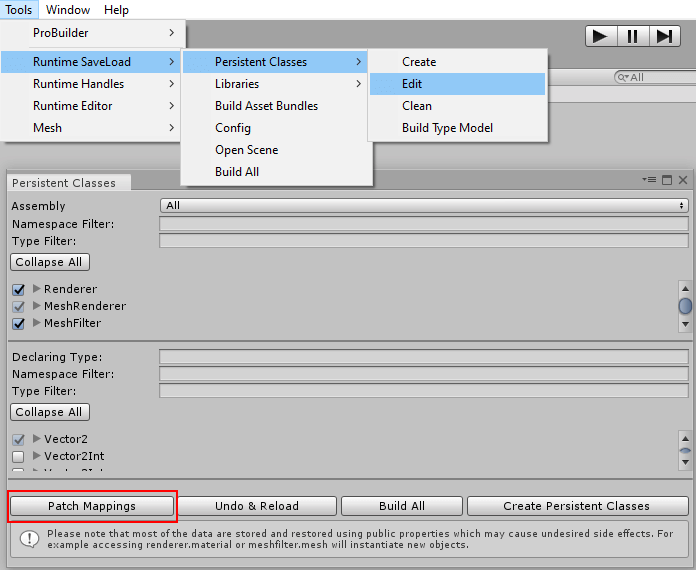
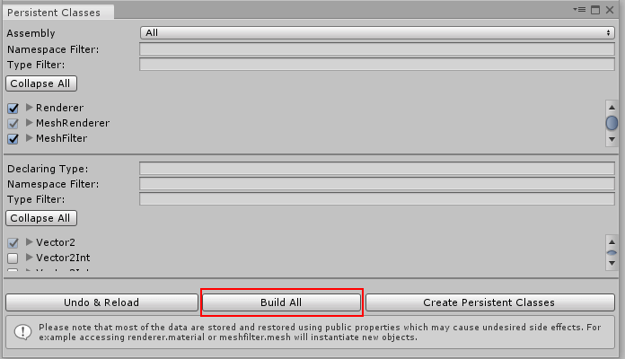

#Introduction

This documentation covers most important parts of Runtime Editor. Unlike previous versions of the documentation, 
I tried to concentrate more on examples rather then documenting each property of each script. [Let me know](mailto:Battlehub@outlook.com) what examples you would like to see.

Start with following sections:

*  [Getting Started with Transform Handles](transform-handles.md#getting-started)
*  [Getting Started with Runtime Editor](runtime-editor.md#getting-started)
*  [Getting Started with Save & Load](save-load.md#getting-started)
*  [Expose To Editor](infrastructure.md#expose-to-editor)
*  [Event methods](infrastructure.md#event-methods)
*  [IOC](infrastructure.md#ioc)
*  [Runtime Selection](infrastructure.md#runtime-selection)
*  [Runtime Undo](infrastructure.md#runtime-undo)

##List of Features

  * Position, Rotation, Scale Handles. 
  * Grid, Box Selection, Scene Gizmo.
  * Global & Local coordinates, Local & Center pivot point modes, Vertex & Grid snapping.
  * Gizmos for Colliders, Lights and Audio Sources.
  * Scene navigation, Orthographic & Perspective view.
  * Undo & Redo API.
  * Object selection API.
  * Object life-cycle Events.
  * Play & Edit mode.
  * __Configurable Inspector__.
  * Component & Material editors.
  * 16 Built-in property editors.
  * Add Component control.
  * __Multiple Scenes__ and Cameras support.
  * __Dock Panels__ & Windows Management.
  * Dialogs, Message Boxes, Confirmations.
  * Easy to extend with new windows.
  * __Configurable Main & Context menu__.
  * Fast Virtualizing Tree View for Hierarchy and Project windows.
  * __Configurable Save & Load subsystem__ (almost no coding is required).
  * __Easy to use Project API__.
  * __Static Assets, Asset Bundles and Dynamic Assets support__.
  * Load assets on demand.
  * Multiple Projects support.
  * __Animation Editor__.
  * __Terrain Editor__.
  * __ProBuilder Integration__.
  * __Runtime Scripting__
  
##Runtime Editor 2.0.5 to 2.1.0 upgrade procedure
Following upgrade procedure is intended to make Runtime Editor v2.1.0 compatible with saved files created by Runtime Editor v2.0.5. 

1. Make sure you have __PersistentClassMappings__ and __PersistentSurrogateMappings__ prefabs in __Assets/Battlehub/RTSL_Data/Mappings/Editor__ folder. In case you don't have these prefabs go to __Tools->Runtime SaveLoad->Persistent Classes->Edit__ and click __Create Persistent Classes__ button.

&nbsp;
2. Remove all subfolders from __Battlehub__ folder except __RTEditor_Data__ and __RTSL_Data__. Also remove __RTSL_Data/Scripts__ folder.
	* If you didn't change anything in __RTSL_Data/CustomImplementation__ then remove it also
	* In case you have your own custom implementations go to Scripting Define Symbols in Player Settings and add __RTSL_MAINTENANCE__. Please __NOTE!__ that after finishing upgrade procedure this define symbol must be removed.

&nbsp;

&nbsp;
3. Reopen project in Unity 2019.3.0f1 or higher.
4. Import Runtime Editor 2.1.0.
5. Open __Tools->Runtime SaveLoad->Persistent Classes->Edit__ and click __Patch Mappings__ button

&nbsp;
6. Click __Build All__ button.

&nbsp;
7. Runtime Editor is upgraded, saved files should load without issues.

!!! note   
		Make sure __RTSL_MAINTENANCE__ scripting define symbol added at step 2 was removed
		
##About
Hi, I am [Vadym](https://www.facebook.com/vadim.andriyanov). I made a lot of efforts creating Runtime Editor but this was interesting and rewarding experience. First version of Runtime editor was released in June 2016 and was pretty simplistic. Current version is much more sophisticated but in the same time much more flexible and contains a lot of useful features. 
If you have any questions or suggestions send an email to [Battlehub@outlook.com](mailto:Battlehub@outlook.com) or join this [support group](https://t.me/battlehub). I hope you will enjoy using Runtime Editor and it will be helpful.