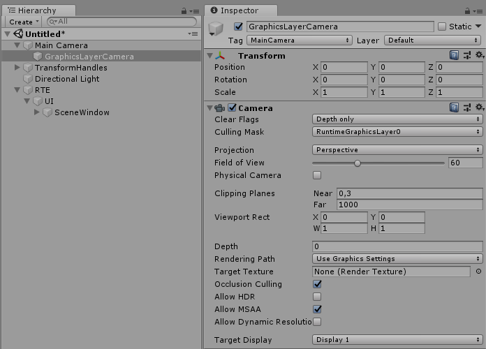
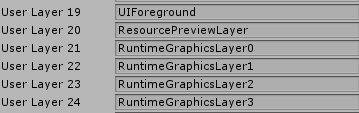

#Rendering Notes
##IGL

All transform handles and gizmos implement IGL interface in order to be rendered in the scene

``` C#

namespace Battlehub.RTCommon
{
    public interface IGL
    {
        void Draw(int cullingMask);
    }
}
	
```
##GLRenderer
Located in __Assets/Battlehub/RTCommon/Scripts/Graphics/GLRenderer.cs__ , GLRenderer is a singleton used by [GLCamera](#glcamera) script to render all registered [IGL](#igl) objects.
To register object for rendering call ```void Add(IGL gl)``` method. To cancel object rendering call  ```void Remove(IGL gl)``` method.

Here is how to create and register gizmo for rendering:

``` C#

namespace Battlehub.RTCommon
{
    public class MyGizmo : MonoBehaviour, IGL
	{
		[SerializeField]
		private Material m_material;
		
	    private void OnEnable() 
		{
            if (GLRenderer.Instance != null) 
			{
                GLRenderer.Instance.Add(this);
            }
        }
		
		private void OnDisable()
		{
			if (GLRenderer.Instance != null) 
			{
				GLRenderer.Instance.Remove(this);
			}
		}
		
		private void Draw(int cullingMask)
		{
			m_material.SetPass(0);
            RuntimeGraphics.DrawQuad(transform.localToWorldMatrix);
		}
    }
}
	
```

!!! note

	It is possible that above code will not work with new [scriptable rendering pipeline](https://docs.unity3d.com/Manual/ScriptableRenderPipeline.html).  
	In this case [Runtime Graphics Layer](#runtime-graphics-layer) will be used to draw gizmos in future versions . 
	

##GLCamera
Located in __Assets/Battlehub/RTCommon/Scripts/Graphics/GLCamera.cs__   
Add __GLCamera__ component to Camera and it will render [IGL objects](#igl).


##Runtime Graphics Layer
Located in __Assets/Battlehub/RTCommon/Scripts/Graphics/RuntimeGraphicsLayer.cs__.  
This component is created automatically in case if [position handle](transform-handles.md#position-handle), [rotation handle](transform-handles.md#rotation-handle) or
[scale handle](transform-handles.md#scale-handle) has reference to corresponding model (`Model` field is not null). This script will create Graphics Layer Camera parented to scene camera (main camera by default)
and will set `Clear Flags` to the _Depth only_ and `Culling Mask` to the _RuntimeGraphicsLayer_. At the same time _RuntimeGraphicsLayer_ will be excluded
from `Culling Mask` of scene camera. Transform handle models belong to _RuntimeGraphicsLayer_ and therefore they will be renderer by Graphics Layer Camera only.



!!! note
	
	[Runtime Editor](runtime-editor.md) use 6 layers [19-24]: for ui, for asset previews and for runtime graphics. 

