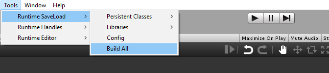
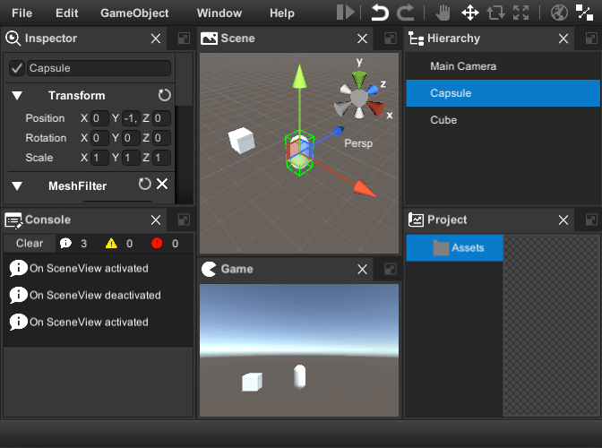

#Runtime Editor Docs
##Overview
<a href="http://u3d.as/v9j" target="_blank"><strong>Runtime Editor</strong></a> is the set of scripts and prefabs which help you to create scene editor, game level editor or build your own modeling application.
It supports [drag & drop](infrastructure.md#drag-and-drop), [undo & redo](infrastructure.md#runtime-undo) and [selection](infrastructure.md#runtime-selection) api.
To implement user interface and core functions runtime editor use [transform-handles](transform-handles.md), [gizmos](gizmos.md), [save load subsystem](save-load.md) and three controls: [menu](menu-control.md), [virtualizing tree view](vtv.md)  and [dock panels](dock-panels.md).
Out of the box it has six Views:
  
  * [Scene View](#scene-view) to manipulate objects in the scene.
  * [Hierarchy View](#hierarchy-view) for displaying and manipulating the object tree.
  * [Project View](#project-view) to manage assets and scenes.
  * [Inspector View](#inspector-view) to display and edit object properties.
  * [Console View](#console-view) to display information, warnings and errors.
  * [Game View](#game-view) for the game.
  * [Add More...](#how-to-add-custom-window-to-window-manager)
  
The Runtime Editor has many ready-to-use [property](#property-editor) and [component](#component-editor) editors and it is relatively easy [to create new ones](#how-to-create-component-editor). __"Add Component"__ drop-down button allows you to add components at runtime.
There are also several important [dialogs](#dialogs) included:
  
  * Save Scene Dialog.
  * Object Picker.
  * Color Picker.
  * Asset Bundles and Libraries Importer.
  * Manage Projects Dialog.


#Getting Started

To get started with Runtime Editor do following:

1. Create new scene and __save__ it.
2. Click Tools->Runtime Editor->Create

	
	<br/><br/>
	
3. Add Battlehub/RTEditor/Scripts/__Game View Camera__ component to __Main Camera__

	
	<br/><br/>

4. Create several Game Objects and add [__Expose To Editor__](#infrastructure.md#expose-to-editor) component.

	
	<br/><br/>
	
5. Click [__Tools->Runtime SaveLoad->Build All__](save-load.md)

	
	<br/><br/>
	
6. Hit Play

	
	<br/><br/>
	

Few more steps:

1. [Create Asset Library](save-load.md#how-to-create-asset-library)
2. Launch runtime editor and click __File->Import Assets__.
	
	
	<br/><br/>
	
3. Select the built-in asset library created in step 1.

	
	<br/><br/>

4. Import assets.

	
	<br/><br/>

5. You will see the imported assets in the project window.

	
	<br/><br/>


##Main & Context Menu

Runtime Editor use [Menu control](menu-control.md) to implement main and context-menu. To extend main menu create static class with __[MenuDefinition]__ attribute and add static methods with __[MenuCommand]__ attribute.

```C#
using Battlehub.RTCommon;
using Battlehub.RTEditor;
using Battlehub.UIControls.MenuControl;
using UnityEngine;

[MenuDefinition]
public static class MyMenu
{
    /// add new command to exising menu
    [MenuCommand("MenuWindow/Create My Window")]
    public static void CreateMyWindow()
    {
        Debug.Log("Create My Window");
    }

    /// add new command to new menu
    [MenuCommand("My Menu/My Submenu/My Command")]
    public static void CreateMyMenu()
    {
        Debug.Log("Create My Menu");
    }

    /// disable menu item
    [MenuCommand("My Menu/My Submenu/My Command", validate: true)]
    public static bool ValidateMyCommand()
    {
        Debug.Log("Disable My Command");
        return false;
    }

    /// replace existing menu item
    [MenuCommand("MenuFile/Close")]
    public static void Close()
    {
        Debug.Log("Intercepted");

        IRuntimeEditor rte = IOC.Resolve<IRuntimeEditor>();
        rte.Close();
    }

    /// Hide existing menu item    
    [MenuCommand("MenuHelp/About RTE", hide: true)]
    public static void HideAbout() { }
}

```
	


To open context menu with your commands do following:

```C#
using Battlehub.RTCommon;
using Battlehub.RTEditor;
using Battlehub.UIControls.MenuControl;
using UnityEngine;


public static class MyContextMenu
{
    public static void OpenContextMenu()
    {
		IContextMenu contextMenu = IOC.Resolve<IContextMenu>();

		MenuItemInfo cmd1 = new MenuItemInfo { Path = "My Command 1" };
		cmd1.Action = new MenuItemEvent();
		cmd1.Action.AddListener((args) =>
		{
			Debug.Log("Run My Command1");

			IRuntimeEditor editor = IOC.Resolve<IRuntimeEditor>();
			Debug.Log(editor.Selection.activeGameObject);
		});

		MenuItemInfo cmd2 = new MenuItemInfo { Path = "My Command 2" };
		cmd2.Validate = new MenuItemValidationEvent();
		cmd2.Action = new MenuItemEvent();
		cmd2.Validate.AddListener((args) =>
		{
			args.IsValid = false;
		});

		cmd2.Action.AddListener((args) =>
		{
			Debug.Log("Run My Command2");
		});

		contextMenu.Open(new[]
		{
			cmd1, cmd2
		});
	}
}

```


Built-in context menu populated and opened from Assets/Battlehub/RTEditor/Scripts/__ProjectFolderView.cs__ and __ProjectTreeView.cs__


##RTEDeps


##Window Manager
##How to: add custom window to Window Manager

!!! note 

    For information on how to create custom window please navigate to this -> [this](infrastructure.md#runtime-window) <- section
     


##Inspector View
##Game Object Editor
##Material Editor
##Component Editor
##Property Editor
##How To: Configure Editors
##How To: Select Component Properties
##How To: Create Component Editor
##How To: Extend Menu
##Hierarchy View
##Project View
##Console View
##Scene View
##Game View
##Dialogs