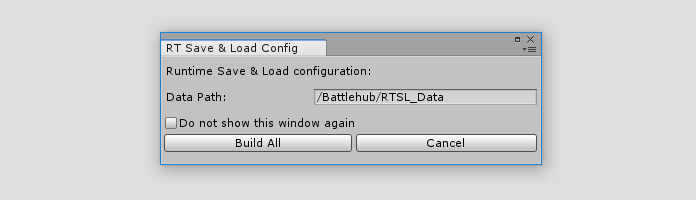
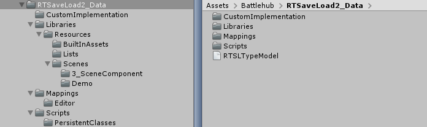
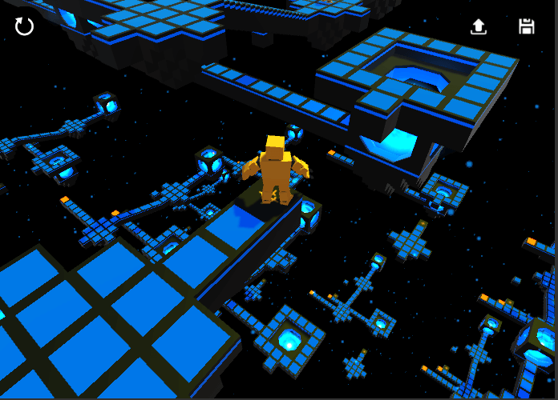

#Save Load Docs
##Overview

The __Runtime Save & Load__ (RTSL) subsystem is needed for saving and managing scenes, assets and projects at runtime and consists of three main parts:
 
 * [Persistent Classes](#persistent-classes) - this part allows you to choose what to serialize and generate persistent classes for serialization. 
 * [Asset Libraries](#asset-library) - this part allows you to create and manage assets, as well as provide information to the RTSL to identify these assets.
 * [Project](#project) - this part provides api to interact with RTSL.

 
!!! note

       RTSL use [protobuf.net](https://github.com/mgravell/protobuf-net) for serialization.
	   
	   
##Getting Started

After importing Runtime SaveLoad you will see the configuration window:



After clicking "Build All", several folders will be created under __/Battlehub/RTSL_Data__



  * __Scripts__ for [serializable persistent classes](#persistent-classes).
  * __Custom Implementation__ for user defined persistent classes.
  * __Mappings__ for mappings between types that must be stored and serializable persistent types. 
  * __Libraries__ for [asset libraries and shader profiles](#asset-library).
  
!!! note
	
	__RTSLTypeModel.dll__ contains [protobuf-net](https://github.com/mgravell/protobuf-net) type model. Due to [unity scripting restrictions](https://docs.unity3d.com/Manual/ScriptingRestrictions.html), runtime type model need to be pre-complied before
    using at runtime.
	
1. Create new scene
2. Drag and Drop __Assets/Battlehub/RTDemoGame/Prefabs/Game.prefab__ to hierarchy.

     
     <br/><br/>
	 
3. Click Tools->Runtime SaveLoad->Libraries->__Collect Scene Dependencies__

	
     <br/><br/>

4. Create Game Object, then add Assets/Battlehub/RTSL/Interface/__Project__ and Assets/Battlehub/RTSL/Interface/__RTSLIgnore__ components. 

	
     <br/><br/>
	 
5. Create __RTSLTest__ script.
6. Hit play.
7. Save scene using 'M' key.
8. Load scene using 'L' key.

``` C#

using System.Collections;

using UnityEngine;
using UnityEngine.SceneManagement;

using Battlehub.RTCommon;
using Battlehub.RTSL.Interface;


public class RTSLTest : MonoBehaviour
{
	private IProject m_project;

	IEnumerator Start()
	{
		m_project = IOC.Resolve<IProject>();

		yield return m_project.OpenProject("My Project");
		yield return m_project.CreateFolder("Scenes/Demo");           
	}

	IEnumerator SaveScene()
	{
		ProjectAsyncOperation ao = m_project.Save("Scenes/Demo/Scene", SceneManager.GetActiveScene());
		yield return ao;

		if(ao.Error.HasError)
		{
			Debug.LogError(ao.Error.ToString());
		}
	}

	IEnumerator LoadScene()
	{
		ProjectAsyncOperation ao = m_project.Load<Scene>("Scenes/Demo/Scene");
		yield return ao;

		if (ao.Error.HasError)
		{
			Debug.LogError(ao.Error.ToString());
		}
	}

	void Update()
	{
		if (Input.GetKeyDown(KeyCode.M))
		{
			StartCoroutine(SaveScene());
		}

		if (Input.GetKeyDown(KeyCode.L))
		{   
			if (m_project.Exist<Scene>("Scenes/Demo/Scene"))
			{
				StartCoroutine(LoadScene());
			}
		}
	}
}

```


Saved scene can be found in [__PersistentDataPath__](https://docs.unity3d.com/ScriptReference/Application-persistentDataPath.html)__/My Project/Assets/Scenes/Demo folder__.

!!! note

    Only few persistent classes enabled and could be saved by default. Use [Persistent Classes Editor Window](#persistent-classes) to enable more.
	
!!! note

    Demo scene can be found in __Assets/Battlehub/RTSL/Demo__ folder.
	 
	 


##Persistent Classes


##Asset Library

##How To: Create Asset Library

##Project Item

##Asset Item

##Project