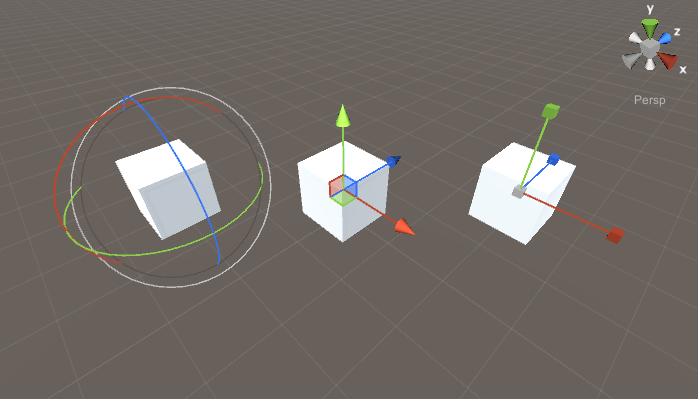
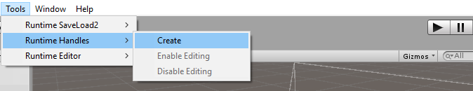
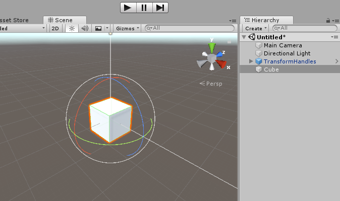
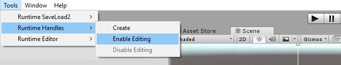
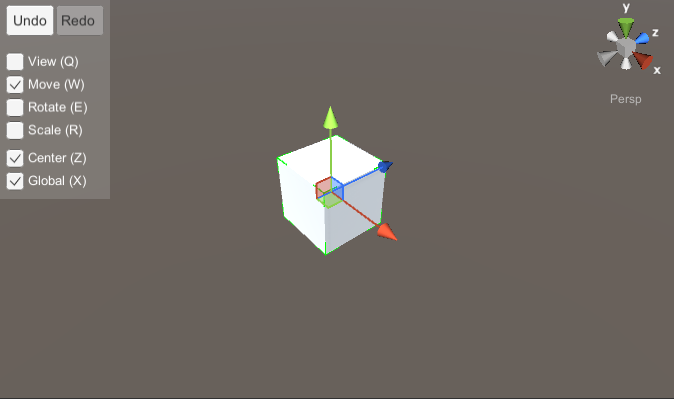

#Transform Handles Documentation
##Overview

__Runtime Transform Handles__ are the __runtime__ 3D controls that are used to manipulate items in the scene. There are three built-in transform tools to [position](#position-handle), [rotate](#rotation-handle) and [scale](#scale-handle) object via transform component. 
Supplementary controls such as [scene gizmo](#scene-gizmo), [selection gizmo](#selection-gizmo) and [grid](#grid) allows to change viewing angle and projection mode, identify selected objects and orientate in scene space. 
Another important components: [selection component](#runtime-selection-component), [scene component](#runtime-scene-component) and [handles component](#runtime-handles-component) allows to select objects, navigate in scene and change transform handles appearance.
Scripts, prefabs and example scenes for transform handles can be found in __Assets/Battlehub/RTHandles__ folder.

!!! note

	Runtime Transform Handles are simply referred as transform handles through this text
   

Here is how transform handles and components rendered in the game view:



##Getting Started

Here are four simple steps to get started with transform handles:

  1. Create transform handles using *Tools->Runtime Handles->Create*
	
 &nbsp;
  2. Create and select Game Object
  	
	&nbsp;
  3. Enable object editing using *Tools->Runtime Handles->Enable Editing*
	
	&nbsp;
  4. Hit play. *After clicking on the Game Object in game view you should see following:*
	
	
!!! note

	Example scenes can be found in Assets/Battlehub/RTHandles/Demo 

	
##Base Handle

This is the base class of position, rotation and scale transform handles. Thus all transform handles have following settings:

   * `Window` - reference to an instance of [window](infrastructure.md/#runtime-window). Interaction with transform handle allowed only in case referenced window is active. 
   * `HighlightOnHover` - bool value. If true then transform handles will be highlighted on pointer over. Set it to false if touch input is used. (default: true)
   * `Appearance` - reference to an instance of [runtime handles component](#runtime-handles-component). Various visual settings.  
   * `Model` - reference to a prefab with BaseHandle model component attached. If Model is set then default rendering procedure will be disabled and prefab instance will be rendered instead.
   * `Targets` - array of transforms to be modified by transform handle.
   * `GridSize` - float value used in unit-snapping mode. By default Unit-snapping mode is activated with 'Shift' key.


##Position Handle


``` C#
	public static void  DoPositionHandle(Vector3  position,  
		Quaternion rotation,
		RuntimeHandleAxis selectedAxis = RuntimeHandleAxis.None,
		bool snapMode = false, 
		LockObject lockObject = null)
	
```

##Rotation Handle
##Scale Handle
##Locking Axes
##Scene Gizmo
##Selection Gizmo
##Grid
##Box Selection
##Runtime Handles Component
##Runtime Selection Component
##Runtime Scene Component