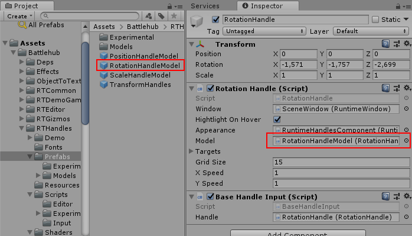

#Transform Handles Documentation
##Overview

__Runtime Transform Handles__ are the __runtime__ 3D controls that are used to manipulate items in the scene. There are three built-in transform tools to [position](#position-handle), [rotate](#rotation-handle) and [scale](#scale-handle) object via transform component. 
Supplementary controls such as [scene gizmo](#scene-gizmo), [selection gizmo](#selection-gizmo) and [grid](#grid) allows to change viewing angle and projection mode, identify selected objects and orientate in scene space. 
Another important components: [selection component](#runtime-selection-component), [scene component](#runtime-scene-component) and [handles component](#runtime-handles-component) allows to select objects, navigate in scene and change transform handles appearance.
Scripts, prefabs and example scenes for transform handles can be found in __Assets/Battlehub/RTHandles__ folder.

!!! note

	Runtime Transform Handles are simply referred as transform handles through this text
   

Here is how transform handles and components rendered in the game view:


##Getting Started

Here are four simple steps to get started with transform handles:

  1. Create transform handles using __Tools->Runtime Handles->Create__.
	
 &nbsp;
  2. Create and select Game Object.
  	
	&nbsp;
  3. Enable object editing using __Tools->Runtime Handles->Enable Editing__.
	
	&nbsp;
  4. Hit play. After clicking on the Game Object in game view you should see following:
	

Following actions available by default:
  
Action       | Input
------------ | ------------- 
Select   	 | Left-click
Move         | Hold middle or right mouse button, then drag
Orbit        | Hold Alt+left-click, then drag 
Zoom         | Use the scroll wheel
Undo		 | Shift + Z (Ctrl + Z in player)  
Redo		 | Shift + Y (Ctrl + Y in player) 
  
!!! note
	Example scenes can be found in Assets/Battlehub/RTHandles/Demo 
	


	
##Base Handle

This is the base class of position, rotation and scale transform handles. Therefore all transform handles have following settings:

   * `Window` - reference to the [window](infrastructure.md/#runtime-window) instance. Interaction with transform handle allowed only in case referenced window is active. 
   * `HighlightOnHover` - bool value. If true then transform handles will be highlighted on pointer over. Set it to false if touch input is used. (default: true)
   * `Appearance` - reference to the [runtime handles component](#runtime-handles-component) instance. Various visual settings.  
   * `Model` - reference to the prefab with BaseHandle model component attached. If Model is set then default rendering procedure will be disabled and prefab instance will be rendered instead.
   * `Targets` - array of transforms to be modified by transform handle.
   * `GridSize` - float value used in unit-snapping mode. By default Unit-snapping mode is activated with 'Shift' key.
   * `BeforeDrag` - event raised before transform handle drag.
   * `Drop` - event raised when drag and drop operation completed.


##Position Handle

To create position handle do following:
	
   1. Create Game Object.
   2. Add __Assets/Battlehub/RTHandles/Scripts/PositionHandle__ script.


It is possible to adjust color and scale of transform handles using [runtime handles component](#runtime-handles-component) while proportions of individual parts such as lines and arrows are adjustable using __Position Handle Model__ script attached to PositionHandleModel.prefab. 
To change position handle proportions modify __Assets/Battlehub/RTHandles/Prefabs/PositionHandleModel.prefab__ and reference it by setting `Model` field of Position Handle.


Position Handle Model script has following fields:

   * `Radius` - line thickness (default: 0,01).
   * `Length` - line length (default: 1).
   * `Arrow Radius` - radius of the arrow cone base (default 0,075).
   * `Arrow Length` - height of the arrow (default 0,2).
   * `Quad Length` - light of side of xy, xz and yz quads (default 0,2).

Adjustments example:


##Rotation Handle

To create rotation handle do following:

   1. Create Game Object.
   2. Add __Assets/Battlehub/RTHandles/Scripts/RotationHandle__ script.


It is possible to adjust color and scale of transform handles using [runtime handles component](#runtime-handles-component). Line thickness and proportions of individual parts are adjustable using __Rotation Handle Model__ script attached to RotationHandleModel.prefab. 
To change rotation handle proportions modify __Assets/Battlehub/RTHandles/Prefabs/RotationHandleModel.prefab__ and reference it by setting `Model` field of Rotation Handle.



Rotation Handle Model script has following fields:

   * `Minor Radius` - line thickness (default: 0,0075).
   * `Major Radius` - x-axis, y-axis, z-axis, inner camera-forward-axis circle radius (default: 1).
   * `Outer Radius` - outer camera-forward-axis circle radius (default: 1,11).
   
Adjustments example:

   
##Scale Handle
To create scale handle do following:

   1. Create Game Object.
   2. Add __Assets/Battlehub/RTHandles/Scripts/ScaleHandle__ script.
   


It is possible to adjust color and scale of transform handles using [runtime handles component](#runtime-handles-component). Line thickness and proportions of individual parts are adjustable using __Scale Handle Model__ script attached to ScaleHandleModel.prefab. 
To change scale handle proportions modify __Assets/Battlehub/RTHandles/Prefabs/ScaleHandleModel.prefab__ and reference it by setting `Model` field of Scale Handle.


Scale Handle Model script has following fields:

   * `Radius` - line thickness (default: 0,01).
   * `Length` - line length (default: 1).
   * `Arrow Radius` - cap size (default: 0,05).

Adjustments example:


##Locking Axes
__Assets/Battlehub/RTCommon/Scripts/LockAxes.cs__ script will prevent certain transformations from being modified by [position](#position-handle), [rotation](#rotation-handle) or [scale](#scale-handle) handles. Attach it to [selectable](#runtime-selection-component) Game Object and choose axes you want to lock.


##Scene Gizmo

To create scene gizmo do following:

  1. Create Game Object.
  2. Add __Assets/Battlehub/RTHandles/Scripts/SceneGizmo__ script.
  
  
  
Scene gizmo script has following fields:
  
   * `Window` - reference to the [window](infrastructure.md/#runtime-window)instance. Interaction with scene gizmo allowed only in case referenced window is active. 
   * `Btn Projection` - UGUI button to switch between orthographic and perspective projection (default: None).
   * `Pivot` - transformation of the object around which the camera rotates.
   * `Size` - scene gizmo size (default: 96,96).
   * `Offset` - scene gizmo offset (default: 0,0).
   * `Appearance` - reference to the [runtime handles component](#runtime-handles-component) instance. Various visual settings.   
   * `Orientation Changing` -  event fires when camera rotation and position are about to be changed.
   * `Orientation Changed` - event fires when camera rotation and position are changed.
   * `Projection Changed` - event fires when camera projection changed.


##Selection Gizmo

Selection gizmo from __Assets/Battlehub/RTHandles/Scripts/SceneGizmo__ is automatically added to [selected](#runtime-selection-component) game object. To change color or hide selection gizmo use `Bounds Color` field of [runtime handles component](#runtime-handles-component).


##Grid

To create grid do following:
  
   1. Select Camera
   2. Add __Assets/Battlehub/RTHandles/Scripts/RuntimeGrid__ script.
   


To change color of the grid use `Grid Color` field of [runtime handles component](#runtime-handles-component).
   
##Runtime Handles Component


##Runtime Selection Component
##Box Selection


``` C#
	public static void  DoPositionHandle(Vector3  position,  
		Quaternion rotation,
		RuntimeHandleAxis selectedAxis = RuntimeHandleAxis.None,
		bool snapMode = false, 
		LockObject lockObject = null)
	
```

##Runtime Scene Component