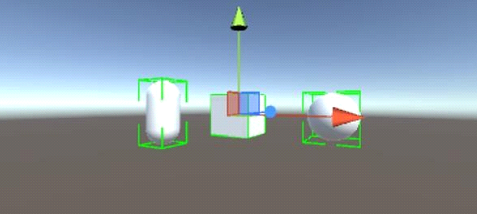

#Transform Handles Documentation
##Overview
##Getting Started



``` C#
	public static void  DoPositionHandle(Vector3  position,  
		Quaternion rotation,
		RuntimeHandleAxis selectedAxis = RuntimeHandleAxis.None,
		bool snapMode = false, 
		LockObject lockObject = null)
	
```

##Base Handle
##Position Handle
##Rotation Handle
##Scale Handle
##Locking Axes
##Scene Gizmo
##Grid
##Box Selection
##Runtime Handles Component
##Runtime Selection Component
##Runtime Scene Component